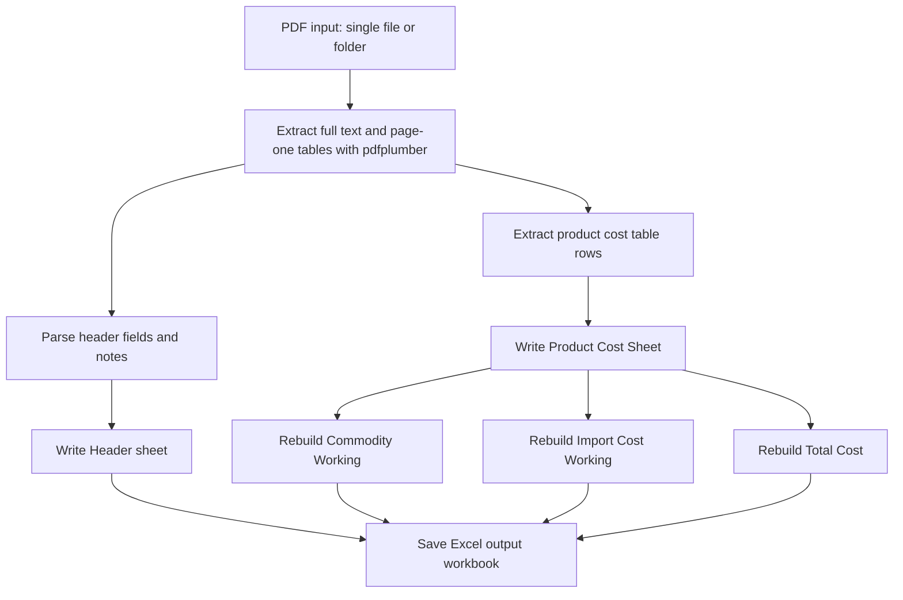

# PDF Data Extraction to Excel

A Python-based ETL utility that extracts structured data from PDF cost sheets and writes the results into an existing Excel template. The project is designed around a repeatable workflow: read one PDF or a folder of PDFs, parse header and product-cost data, populate workbook sheets, and regenerate derived summary sheets.

## Table of Contents

- [Overview](#overview)
- [Problem Statement](#problem-statement)
- [Key Features](#key-features)
- [Technologies Used](#technologies-used)
- [Processing Pipeline](#processing-pipeline)
- [Repository Structure](#repository-structure)
- [Prerequisites](#prerequisites)
- [Installation](#installation)
- [Usage](#usage)
- [Inputs and Outputs](#inputs-and-outputs)
- [Workbook Sheets](#workbook-sheets)
- [Error Handling and Validation](#error-handling-and-validation)
- [Data Privacy and Repository Hygiene](#data-privacy-and-repository-hygiene)
- [Limitations](#limitations)
- [Future Improvements](#future-improvements)
- [Acknowledgements](#acknowledgements)

## Overview

`PDF_Data_Extraction_To_Excel` automates part of a document-processing workflow where cost-sheet PDFs need to be converted into a structured Excel workbook. The script uses an existing workbook template, appends newly processed PDFs when possible, and supports a reset mode for rebuilding the workbook from scratch.

The implementation currently focuses on cost-sheet PDFs that contain extractable text and tables. It is not an OCR pipeline for scanned images.

## Problem Statement

Manual transfer of cost-sheet data from PDFs into Excel is repetitive, slow, and error-prone. This project reduces that manual effort by extracting structured fields and line-item rows from PDFs and writing them into a consistent Excel format that can be reviewed, filtered, and reused.

## Key Features

- Extracts header details from PDF cost sheets.
- Extracts product cost rows from PDF tables.
- Populates an existing Excel template.
- Writes data into five main workbook sheets:
  - `Header`
  - `Product Cost Sheet`
  - `Commodity Working`
  - `Import Cost Working`
  - `Total Cost`
- Rebuilds commodity, import, and total summary sheets from the extracted product-cost data.
- Supports folder-based batch processing.
- Supports single-PDF processing.
- Supports append mode using a hidden `Processed_Files` worksheet to avoid duplicate processing.
- Supports reset mode to rebuild the output workbook from the template.
- Adds basic formatting, freeze panes, and reasonable column widths after writing data.

## Technologies Used

Confirmed from the source code:

- Python
- `pdfplumber` for PDF text and table extraction
- `openpyxl` for reading, writing, and formatting Excel workbooks
- Python standard-library modules including `argparse`, `pathlib`, `re`, and `typing`

## Processing Pipeline



## Repository Structure

Based on the current project layout:

```text
PDF_Data_Extraction_To_Excel/
├── pdf_to_excel.py          # Main extraction and workbook-writing script
├── Excel Template.xlsx      # Excel template used as the workbook base
├── Run Code.txt             # Example command for running the script
├── PDFs/                    # Local input PDF folder
├── output.xlsx              # Generated workbook output
├── output_fixed.xlsx        # Generated workbook output from a previous run
├── README.md                # Project documentation
├── requirements.txt         # Python package dependencies
└── .gitignore               # Local/generated file exclusions
```

The `PDFs/` folder and generated `.xlsx` files may contain confidential business data. Review them carefully before publishing the repository.

## Prerequisites

- Python 3.10 or newer is recommended.
- Access to the source PDF cost sheets.
- Access to the Excel template expected by the script.
- Required Python packages listed in `requirements.txt`.

The script was written for local file execution and uses command-line arguments for file paths.

## Installation

Open PowerShell and change into the project directory first:

```powershell
cd "C:\Users\ASUS\Downloads\PDF2Excel"
```

Create and activate a virtual environment:

```powershell
py -m venv .venv
.\.venv\Scripts\Activate.ps1
```

Install dependencies:

```powershell
py -m pip install -r requirements.txt
```

If you are not using the Python launcher on Windows, replace `py` with `python`.

## Usage

Run these commands from the project directory:

```powershell
cd "C:\Users\ASUS\Downloads\PDF2Excel"
```

### Rebuild the workbook from all PDFs in a folder

This mode starts from the template and processes all PDFs again:

```powershell
py pdf_to_excel.py --folder "PDFs" --template "Excel Template.xlsx" --out "output.xlsx" --reset
```

### Append only new PDFs from a folder

This mode opens the existing output workbook and skips PDFs already listed in the hidden `Processed_Files` worksheet:

```powershell
py pdf_to_excel.py --folder "PDFs" --template "Excel Template.xlsx" --out "output.xlsx"
```

### Process a single PDF

```powershell
py pdf_to_excel.py --pdf "PDFs\Product data.pdf" --template "Excel Template.xlsx" --out "output.xlsx" --reset
```

### Configure paths

The script does not use a separate configuration file. Change the paths through command-line arguments:

- `--folder`: folder containing input PDFs
- `--pdf`: path to one input PDF
- `--template`: path to the Excel template
- `--out`: path to the Excel workbook to create or update
- `--reset`: optional flag for a clean rebuild

Use either `--folder` or `--pdf`, not both.

## Inputs and Outputs

### Input PDFs

The repository includes example local filenames such as:

- `PDFs\Product data.pdf`
- `PDFs\20250203114917340-CS7436 Cost sheet Dt 03.02.2025.pdf`
- `PDFs\20250203115016096-CS7437 Cost sheet Dt 03.02.2025.pdf`

These appear to be company cost-sheet documents. Do not publish them unless you have explicit permission.

### Excel Template

The script expects an existing workbook template, for example:

```text
Excel Template.xlsx
```

The template must include the worksheets used by the script.

### Output Workbook

The generated workbook is written to the path passed with `--out`, for example:

```text
output.xlsx
```

Close the output workbook in Excel before running the script. If the file is open, Windows may lock it and prevent `openpyxl` from saving changes.

## Workbook Sheets

The script writes or rebuilds these main sheets:

| Sheet | Purpose |
| --- | --- |
| `Header` | Stores one row of extracted header metadata per PDF. |
| `Product Cost Sheet` | Stores extracted product cost table rows. |
| `Commodity Working` | Rebuilt from extracted product cost rows. |
| `Import Cost Working` | Rebuilt from extracted product cost rows and exchange-rate data. |
| `Total Cost` | Rebuilt from extracted product cost rows. |

The script also creates or updates a hidden `Processed_Files` worksheet to track processed PDFs during append mode.

## Error Handling and Validation

Implemented behavior includes:

- Stops execution if neither `--pdf` nor `--folder` is provided.
- Stops execution if no PDFs are found.
- Uses `Processed_Files` to avoid duplicate appends in non-reset mode.
- Clears workbook data during reset mode before writing new results.
- Rebuilds derived sheets after product rows are written.
- Applies basic worksheet formatting after extraction.

Important operational note:

- If `output.xlsx` is open in Excel, saving may fail with a permission error. Close the workbook and run the command again.

## Data Privacy and Repository Hygiene

Before making this repository public:

- Remove or replace confidential PDFs.
- Remove generated workbooks that contain company data.
- Do not publish credentials, proprietary cost information, customer data, or internal company templates without permission.
- Keep only anonymized or synthetic sample files if a public demo is needed.

The included `.gitignore` is configured to exclude common generated outputs, local environments, caches, and local PDF/workbook data.

## Limitations

- The project depends on PDFs containing extractable text and tables.
- It does not perform OCR on scanned PDFs.
- PDF layouts must be reasonably similar to the cost-sheet layouts handled by the extraction logic.
- `Commodity Working`, `Import Cost Working`, and `Total Cost` are currently rebuilt from extracted product-cost rows, not copied directly from separate PDF sections.
- Extraction accuracy can vary when PDF table structure, text ordering, or layout changes significantly.
- There is no automated test suite yet.

## Future Improvements

- Add unit tests for header parsing, product-row extraction, and workbook writing.
- Add regression tests using anonymized sample PDFs.
- Add direct extraction support for `Commodity Working` and `Import Cost Working` PDF sections if exact PDF-section replication is required.
- Add structured logging instead of console-only progress messages.
- Add validation reports that compare extracted row counts per PDF.
- Add a small anonymized sample dataset and expected output workbook for public demonstration.
- Add optional OCR support for scanned PDFs.

## Acknowledgements

This project uses open-source Python libraries, especially `pdfplumber` for PDF extraction and `openpyxl` for Excel workbook operations.
